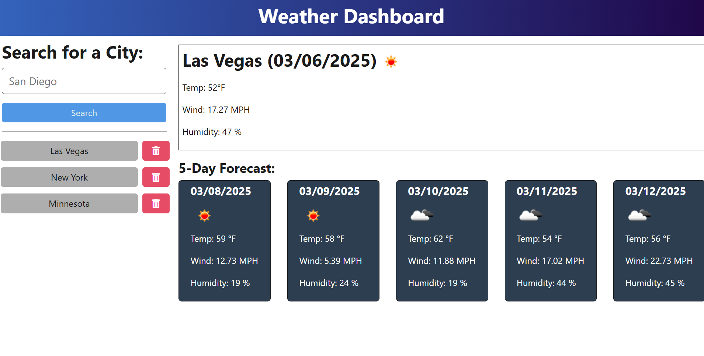

# Weather Forecast App

## Table of Contents
* [Description](#description)
* [Installation](#installation)
* [Usage](#usage)
* [License](#license)
* [Contributing](#contributing)
* [Tests](#tests)
* [Contact Me](#contact-me)

## Description 
The Weather Forecast App is a full-stack web application that allows users to search for weather information for a specific location. The application features a clean and intuitive user interface, with real-time weather updates, search history, and a responsive design.

## Installation 
To set up the Weather Forecast App, follow these steps:
1. Ensure you have Node.js installed on your computer.
2. Download the project files and open them in your source code editor.
3. Open a new terminal connected to the project folder.
4. Run npm install to install all dependencies.
5. Navigate to the .env file in the root directory of the project and add your OpenWeatherMap API key and API BASE URL=https://api.openweathermap.org/data/2.5/forecast.

## Usage 
Once you have installed all dependencies and set up the .env file, follow these steps to run the app:
1. Open a terminal connected to the project folder.
2. Run npm start.
3. Open your web browser and navigate to localhost:3001.
4. Enter a location name or select a location from the autocomplete suggestions to view weather  information.

## License 
MIT

## Contributing 
The Weather Forecast App is an open-source project, and contributions are welcome! If you'd like to contribute, please contact me.

## Tests 
N/A

## Contact Me:
* Email: angelic722@gmail.com
* Github: Thida612

## Deployed Link:
https://weather-forecast-app-3.onrender.com   

